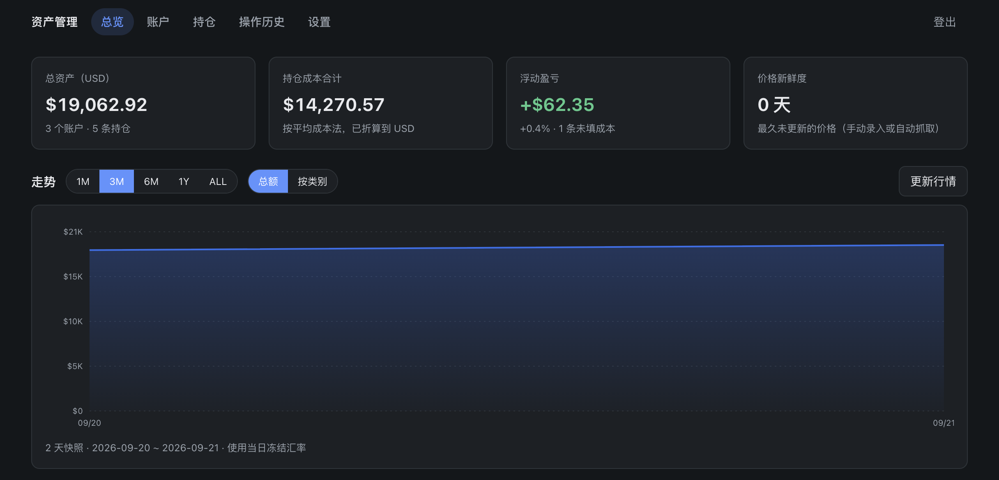
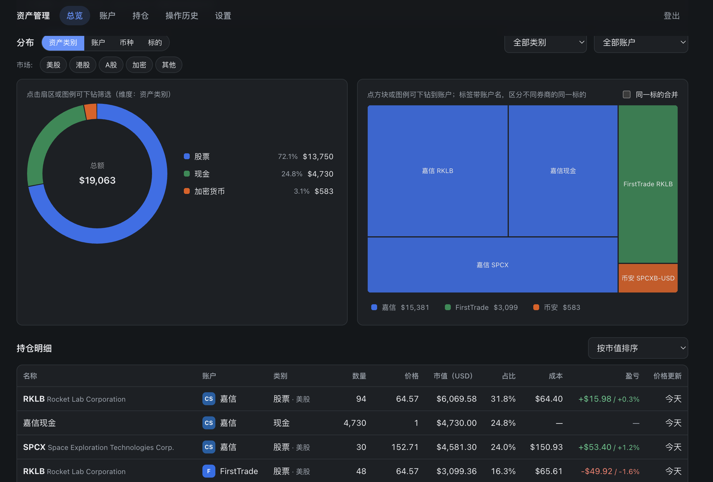
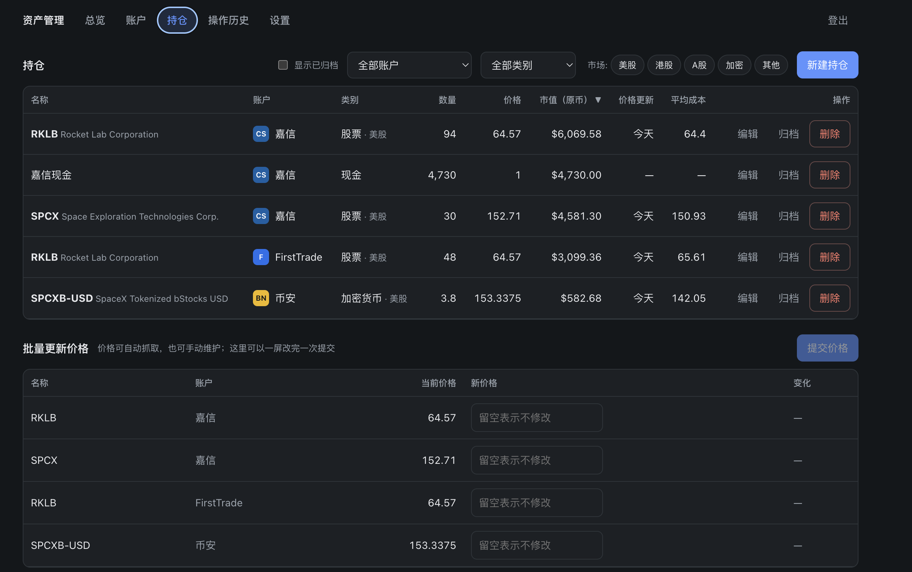
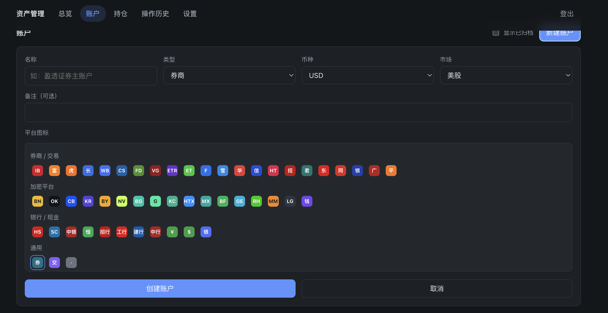

# Asset Manager · Personal Portfolio Tracker

> **Every account, one page.**
> Stocks, ETFs, crypto and cash from all your brokers and exchanges, brought into a single view —
> refresh quotes in one click and your total and unrealised P&L are ready. No logging in to each app.

**Everything runs inside Cloudflare's free tier** (Workers + D1 + static assets): your data lives in your own
Cloudflare account, there is no server to run, no telemetry and no third-party analytics; a net-worth snapshot
is taken automatically every day, so the history builds itself.

**English** | [简体中文](README.md)

[](https://github.com/jiangbo202/asset-manager/actions/workflows/ci.yml)
[](LICENSE)
[](https://workers.cloudflare.com/)
[](#-does-it-stay-within-the-free-tier)

> **After forking, run `npm run setup:repo` once** — it reads your git remote and points the docs, badges and
> issue templates at your own repository instead of this one.

---

## 📸 Screenshots

### Dashboard · key numbers and net-worth trend



Four cards give you the whole picture at a glance. The trend chart switches between `1M / 3M / 6M / 1Y / ALL`
and between total and stacked-by-class. “Refresh quotes” fetches the latest prices immediately instead of
waiting for the daily job.

### Dashboard · allocation and holdings



The donut has four dimensions — **class / account / currency / symbol** — and clicking a slice filters the page.
The treemap drills down into a single account; tick “Merge same symbols” to collapse one stock held at several
brokers into one block (hover it to see the per-account breakdown). The holdings table sorts by any column,
including how stale each price is.

### Holdings · entry and bulk price updates



Typing a symbol auto-fills the name, currency and market; “Get latest price” fills the price in one click.
The bulk price table at the bottom lets you update everything in one screen and submit once.

### Accounts · built-in platform icons



**53 built-in icons** for brokers, crypto platforms and banks — letter marks in brand colours, so there are no
trademark issues. Accounts without an icon get a colour derived from their name.

---

## 📑 Contents

1. [Screenshots](#-screenshots)
2. [What it does](#-what-it-does)
3. [Deployment in 5 minutes](#-deployment-in-5-minutes)
4. [First-run checklist](#-first-run-checklist)
5. [Local development](#-local-development)
6. [Language and time zone](#-language-and-time-zone)
7. [Quotes and FX rates](#-quotes-and-fx-rates)
8. [Backup and restore](#-backup-and-restore)
9. [Data and privacy](#-data-and-privacy)
10. [Does it stay within the free tier?](#-does-it-stay-within-the-free-tier)
11. [FAQ](#-faq)
12. [Upgrading](#-upgrading)
13. [Development and contributing](#-development-and-contributing)
14. [Roadmap](#-roadmap)

---

## ✨ What it does

**Bookkeeping**

- Accounts: broker / crypto platform / cash, with market, currency and notes; archivable
- Holdings: stocks, ETFs, crypto, funds and cash — cash only needs a balance
- Average-cost P&L, archiving, bulk price updates, and the same symbol in several accounts kept separately
- Typing a symbol auto-fills name / currency / market, and “Get latest price” fetches the current quote

**Looking at the numbers**

- Donut chart (class / account / currency / symbol, click to filter) and a treemap (drill down, optional
  merge-by-symbol)
- Daily trend: pick a range, show the total or stack by class, hover for that day's breakdown
- Holdings table sortable by any column, including price staleness; markets are multi-select (picking “crypto” also lists tokenised stocks)
- **Filters live in the URL**, so refreshing, bookmarking or sharing a link restores the same view

**Market data**

- Free public APIs out of the box, **no configuration needed**; each symbol is tried against several providers
  in order, falling through on failure
- Batch endpoints are preferred to save requests; rate-limited providers are cooled down and skipped instead of
  failing silently
- Bring your own API key (stored encrypted) or point the custom provider at any HTTP quote service

**History and traceability**

- **Daily snapshots**: the Cron trigger refreshes quotes at your configured hour and takes the day's net-worth
  snapshot right after (see [Quotes and FX rates](#-quotes-and-fx-rates))
- **FX rates are frozen per day**, so editing a rate later never shifts the historical curve
- Activity history: every write is recorded, the list shows *what* changed and *what it was*, and expanding a row
  reveals the field-level diff
- Backup: export JSON (optionally with history, optionally encrypted with a passphrase); imports are fully
  validated and **diffed before anything is written**, in either merge or replace mode

**Sharing**

- **Public read-only link** (off by default): turn it on and anyone with the link can see the overview
  without a password; a sign-in button sits in the top bar. Visitors cannot see account notes,
  history, settings or backups, and cannot refresh quotes. Turn it off and the link shows the sign-in page again.

**Other**

- Multi-currency with a switchable display currency — holdings missing an FX rate are clearly marked
  **“not converted”** instead of being silently treated as 1:1; stablecoins (USDT/USDC…) convert at 1:1 USD
- Quote failures say **which provider was asked, with which symbol, and what we treated it as**
  (class · market · symbol override); repeated failures are flagged as a likely wrong symbol or setting
- Saving a holding validates that market and symbol agree (HK / A-share codes must be digits), so those
  mistakes are caught at entry time
- Chinese and English (the English dictionary loads on demand) and a configurable time zone
- Responsive: secondary columns drop on narrow screens, forms collapse to one column

## 🚀 Deployment in 5 minutes

```bash
git clone https://github.com/jiangbo202/asset-manager.git
cd asset-manager && npm install

export CLOUDFLARE_API_TOKEN=your-token      # Windows: $env:CLOUDFLARE_API_TOKEN="your-token"
npm run deploy:safe
```

`deploy:safe` checks your login, creates or reuses the D1 database, builds, applies migrations, deploys the
Worker and writes the secrets — then prints the `SETUP_TOKEN` **once** in the terminal.
The token needs **Workers Scripts: Edit + D1: Edit** permissions.

### Or use the one-click deploy

[](https://deploy.workers.cloudflare.com/?url=https://github.com/jiangbo202/asset-manager)

Cloudflare copies the repo into your account, creates and binds D1, asks for two secrets, and builds through
Workers Builds:

| Name | Where it comes from |
|---|---|
| `SETUP_TOKEN` | `openssl rand -hex 32` — keep it, you need it the first time you open the site |
| `SESSION_SECRET` | `openssl rand -hex 32` |

> The wizard pre-fills the sample values that are public in this repository, so **replace both**. The server
> refuses to initialise with a placeholder, so you can never end up with an instance anyone can take over.

More commands and troubleshooting: **[docs/DEPLOYMENT.md](docs/DEPLOYMENT.md)** (Chinese).

## ✅ First-run checklist

1. Complete initialisation with the `SETUP_TOKEN` and set your own password
2. Confirm the **display currency** (USD by default) and **time zone** (UTC by default)
3. For non-USD assets, add FX rates under Settings → FX rates — or click **“Fetch latest rate”**
4. Create your broker / crypto / cash accounts under Accounts
5. Add holdings with symbol, quantity, price and average cost under Holdings
6. Glance at Settings → Data overview to see how much of the free tier you are using

## 💻 Local development

```bash
cp .dev.vars.example .dev.vars
npm run db:migrate:local && npm run db:seed:local
npm run dev            # http://localhost:5173
```

Local data lives in `.wrangler/state/` and **consumes none of your production quota**; `npm run dev` applies
local migrations first. Use the `SETUP_TOKEN` from `.dev.vars` on the setup page.
Full guide: **[docs/LOCAL_DEV.md](docs/LOCAL_DEV.md)** (Chinese).

## 🌐 Language and time zone

**Language**: Settings → language — follow the browser, Simplified Chinese, or English. It applies immediately
and travels with backups. Server-side messages (validation errors, import warnings, quote failures, activity
notes) are localised from the request's `Accept-Language` too.

**Time zone**: UTC by default, with 21 common IANA zones built in, and any other name such as `Asia/Shanghai`
can be typed in.

| What the time zone affects | Detail |
|---|---|
| Which day and hour the daily snapshot uses | Based on that zone's calendar day and hour; change the zone and the schedule follows |
| Effective dates in price / quantity history | Manual entries and fetched prices both use “today” in that zone |
| Activity history date filters | 2026-09-20 means that day in your zone |
| How timestamps are displayed | Rendered in that zone, not in the local time of whatever machine you opened |

The database always stores UTC; the time zone only decides how a calendar is interpreted, so changing it never
shifts historical data.

## 📈 Quotes and FX rates

| Provider | Covers | Notes |
|---|---|---|
| CoinGecko | Crypto | No key, several coins per request; use a coin id (`bitcoin`); common ones are mapped |
| Binance | Crypto | No key, several pairs per request; fallback |
| Yahoo Finance | Stocks / crypto / FX | Widest coverage: US, HK `.HK`, A-shares `.SS/.SZ`, `BTC-USD`, `HKD=X` |
| Tencent | HK / A-shares | Several codes per request (`hk00700`); fallback |
| Frankfurter (ECB) | FX | No key, updated on business days |
| open.er-api | FX | Fallback with more currencies |
| Custom | Anything | URL template + dotted JSON path + custom headers |

Symbol mapping (override per holding under “quote symbol”):

```
700    + HK      → Yahoo 0700.HK   / Tencent hk00700
600519 + A-share → Yahoo 600519.SS / Tencent sh600519
BTC    + crypto  → CoinGecko bitcoin / Binance BTCUSDT / Yahoo BTC-USD
```

### When does it fetch automatically?

**Quotes**: once a day (Cron, at the hour you configure), or whenever you press “Refresh quotes”.

**FX rates** are not a separate job — they ride along with the quote refresh, happen only at those two moments,
and only for currencies your portfolio actually uses. To get a rate right now, open Settings → FX rates and press
**“Fetch latest rate”**: providers are tried in priority order and the result is **filled into the field**, which
you then save with “Save rate”.
(The button deliberately does not save: manual rates take precedence and are never overwritten, so saving on one
click would silently freeze that pair.)

### How snapshots are taken

The Cron trigger wakes up every hour and **does only one heavy thing per invocation**:

| When (in your time zone) | What happens |
|---|---|
| Exactly the configured hour | Refresh quotes |
| Any later hour, if the day has no snapshot yet | Take the snapshot |

So the snapshot usually lands an hour after the refresh and uses the prices fetched earlier that day — fine for
daily data. If a step does not complete, the remaining hours of the same day retry it: the free tier allows only
10 ms of CPU per invocation, and doing both in one invocation would exceed it consistently.

## 💾 Backup and restore

Three layers; use at least the first two:

1. **In-app export** (Settings → Backup): JSON, optionally including activity history, optionally encrypted with
   a passphrase (AES-GCM in your browser — the passphrase is never sent to the server). Imports can be previewed
   as a diff first, in **merge** or **replace** mode.
2. **Command-line full backup**:

   ```bash
   npx wrangler d1 export DB --remote --output=backup-$(date +%F).sql
   # restore: npx wrangler d1 execute DB --remote --file=backup-2026-09-20.sql
   ```

3. **Cloudflare Time Travel** (free, 7 days): Dashboard → D1 → Time Travel rolls back to any point in time.

> A backup file is your entire portfolio — treat it like a password.
>
> Backups contain **no credentials**: no password, no sessions, no third-party API keys and no custom-provider
> headers. On a new environment, initialise again and re-enter the keys you need.

## 🔐 Data and privacy

- All data lives in your own Cloudflare D1 database; there is **no backend server** and nothing is uploaded
- No analytics, no telemetry, no third-party fonts or CDNs
- Passwords are stored only as an irreversible verifier — even a database leak does not let anyone log in
  (see [SECURITY.md](SECURITY.md))
- Third-party API keys are encrypted with a key derived from `SESSION_SECRET`; the API never returns them

## 💰 Does it stay within the free tier?

Yes. Typical personal usage, with measured numbers:

| Resource | Actual usage | Free tier |
|---|---|---|
| Worker requests | < 1,000 / day | 100,000 / day |
| Worker CPU | page reads 1–4 ms; quote refresh ≈ 8 ms; snapshot ≈ 5 ms | 10 ms / request |
| D1 rows read | < 50,000 / day | 5,000,000 / day |
| D1 rows written | < 100 / day | 100,000 / day |
| D1 storage | < 20 MB | 5 GB |
| Cron | 1 trigger (hourly, active only in the configured hour) | 5 / account |
| Subrequests | one batch fetch a day, 5–10 requests measured | 50 / invocation |
| Static assets | 93 KB gzip first load + on-demand chunks | free |

The CPU figures come from `npm run watch:cpu`, which streams the `cpuTime` of live invocations. The free tier
allows 10 ms per invocation, so the whole architecture is built around it:

- PBKDF2 for authentication runs **in the browser**; the Worker only does one SHA-256
- Aggregation happens in SQL, not by walking rows in JS; trend points are downsampled server-side
- Every endpoint reads what it needs in **one `db.batch`** (measured: a single D1 statement costs roughly
  0.3 ms locally / 2 ms in production, while several statements inside one batch share a single round trip)
- Quote refresh and snapshot are **split into two invocations** so they never add up
- `tests/api/query-budget.test.ts` pins the statement and round-trip budget of every route, so adding a serial
  query back fails CI

Settings → Data overview shows your real row counts at any time.

## ❓ FAQ

**I forgot my password.**
Dashboard → Workers & Pages → D1 → `asset-manager-db` → Console, run `DELETE FROM auth;`, then
`npm run setup:secrets -- --rotate` to get a new `SETUP_TOKEN` and initialise again. Accounts and holdings are
untouched.

> `setup:secrets` is idempotent by default (it never overwrites existing secrets), because `SESSION_SECRET`
> encrypts your stored API keys — rotating it logs everyone out and requires re-entering those keys, so it takes
> an explicit `-- --rotate`.

**I lost the `SETUP_TOKEN`.**
Same as above: delete the `auth` row, then `npm run setup:secrets -- --rotate`. The token is printed only once.

**After upgrading it says “the database needs an upgrade”.**
The schema is behind the code. Run `npm run db:migrate:local` (local) or `npm run db:migrate:remote`
(production, or just re-run `npm run deploy:safe`). Migrations are idempotent and never touch existing data.

**`Authentication error [code: 10000]` while deploying.**
The API token is missing or lacks permission. It needs **Workers Scripts: Edit + D1: Edit**, or use
`npx wrangler login` instead.

**How do I confirm the scheduled job actually ran?**
The activity history gets entries with source `system`: “刷新行情…” for the scheduled quote refresh, and
“定时快照…” / “补拍当日快照…” for snapshots. The Quotes & snapshots card in Settings also shows the
**last quote refresh** and the **next scheduled run**.

**How do I share it with someone?**
Settings → “Public read-only link”, switch it on and send the URL shown there. Visitors see the overview only
(total, breakdowns, treemap, trend, holdings table) with a “Read-only” badge and a sign-in button. Turn the
switch off and the same URL shows the sign-in page.

**Why did prices not update?**
Quotes refresh once a day, at the hour configured under Settings → Quotes & snapshots (22:00 by default, in your
time zone). Press “Refresh quotes” to update immediately.

**How should I write HK / A-share codes?**
Any of `700`, `0700`, `3121`, `03121`, with or without the `.HK` suffix — on save they are normalised to the
HKEX 5-digit form (`00700`, `03121`), the same way your broker statement writes them. At request time they are
converted to what each provider expects: Yahoo wants the 4-digit `3121.HK`, Tencent the 5-digit `hk03121`.

**What is the “beacon.min.js blocked by CSP” message in the console?**
That is Cloudflare's own Web Analytics script (`static.cloudflareinsights.com`); our CSP only allows
`script-src 'self'`, so it is blocked — which is the intended behaviour (this project ships no third-party
scripts). Turn Web Analytics off for the site in the Cloudflare dashboard if you want the message gone.

**What is the “rate-limit cooldown”?**
Free APIs rate-limit by IP. When a provider is limited it is paused for 10 minutes (30 minutes after three
consecutive failures) and other providers are used instead. Cooldown state and the last error are visible in
Settings; bring your own API key or a custom provider to avoid it entirely.

**Why are some days flat in the trend chart?**
There is no snapshot for that day (a late deployment, or the Worker was not triggered); the previous day's value
is carried forward and marked “carried over”. A missed snapshot is retried later the same day, and you can take
one manually.

**Can I point it at my own quote service?**
Yes. Settings → Quotes & snapshots → custom provider: a URL template (`{symbol}` for the symbol, `{key}` for the
secret) plus a dotted JSON price path such as `data.price`.

**Can several people share one instance?**
No, and that is intentional: single user, single password, data in your own account.

## 🔄 Upgrading

```bash
git pull
npm install
npm run deploy:safe      # applies new D1 migrations automatically
```

Export a backup before upgrading. If the page still says the database needs an upgrade, the migration did not
run — see the FAQ.

## 🛠 Development and contributing

```bash
npm run dev        # dev server (workerd + HMR, Worker debug port 9229)
npm run build      # build frontend and Worker
npm run preview    # run the built output locally, close to production
npm test           # Vitest, running inside real workerd
npm run lint       # type-checks four tsconfig projects
npm run verify     # all of the above + bundle budget + script wiring checks
npm run watch:cpu  # live CPU time of every invocation (free-tier debugging)
```

The stack is deliberately small: **Hono + D1 + React**, with no UI library, no chart library and no state
management library. Every chart (donut, treemap, trend) is hand-written SVG and CSS.

```
src/worker/     Worker: api routes / core infrastructure / data access / services
src/web/        Frontend: lib (api, i18n, charts…), pages, components
src/shared/     Shared: types, enum labels, i18n dictionaries, time-zone helpers
migrations/     D1 migrations (append-only, never edit a shipped file)
scripts/        Deployment and local-development scripts
tests/          Vitest, running on the workerd runtime rather than a jsdom mock
```

Read **[CONTRIBUTING.md](CONTRIBUTING.md)** before changing code (conventions, test expectations, doc index).
The in-depth documentation under [`docs/`](docs) is written in Chinese.

## 🗺 Roadmap

- **CSV import**: broker statements with column mapping and duplicate detection
- **Trading-calendar awareness**: carry the closing price across non-trading days
- **More automatic FX rates**: ECB coverage is limited
- **Transaction ledger**: FIFO cost basis, dividends, splits, recurring buys
- **TOTP two-factor auth**, custom icon upload, multi-user / family sharing

## 📚 Documentation

| Document | Contents |
|---|---|
| [docs/PRD.md](docs/PRD.md) | Requirements, confirmed decisions, acceptance criteria |
| [docs/ARCHITECTURE.md](docs/ARCHITECTURE.md) | Architecture, data model, free-tier guardrails, trade-offs |
| [docs/DEPLOYMENT.md](docs/DEPLOYMENT.md) | Deploy scripts, the three paths, troubleshooting |
| [docs/LOCAL_DEV.md](docs/LOCAL_DEV.md) | Local development, debugging, D1 operations |
| [docs/OPERATIONS.md](docs/OPERATIONS.md) | Migrations, backup/restore, upgrades, cron, troubleshooting |
| [SECURITY.md](SECURITY.md) | Security model and vulnerability reporting |
| [CONTRIBUTING.md](CONTRIBUTING.md) | Contribution guide |

## 📄 License

[MIT](LICENSE). A personal bookkeeping tool, **not investment advice**; check the rules that apply to recording
crypto assets in your jurisdiction.
